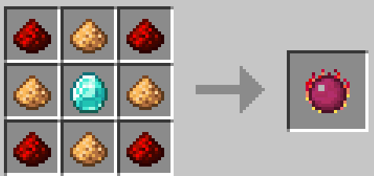
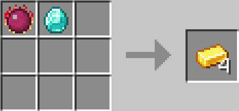
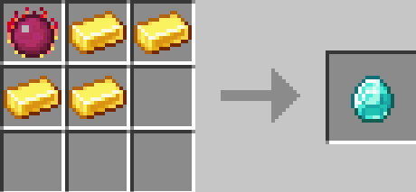
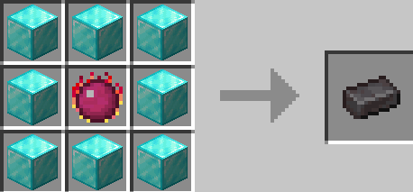
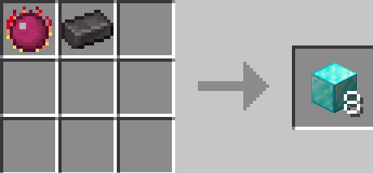
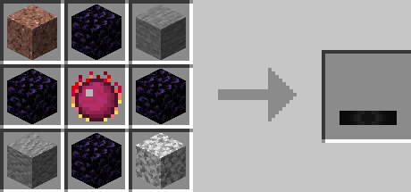
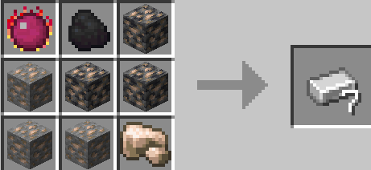

>

* 贤者之石的合成表
* Philosopher_Stone's Recipe
>

* 向下降级矿物
* Downgrade Ore
>

* 向上升级矿物
* Upgrade Ore
> 特殊合成 Special Crafting

>

* 转换桌 任意石头都可以
* Transmutation Table  Any Stone can be used
>

* 矿物冶炼 任意同种矿物
* Ore Smelting  Any Ore of the same type
>